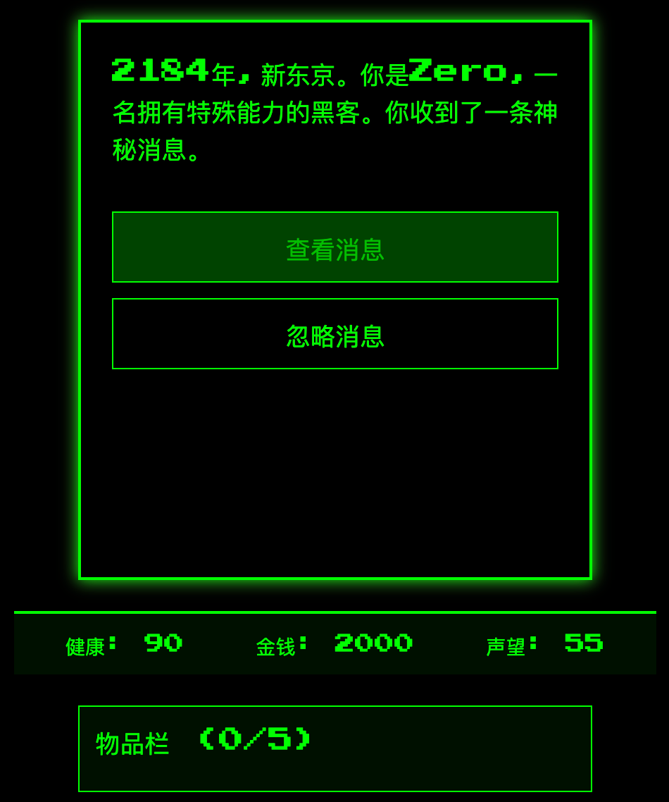

# Cyber Nexus

> Cursor 10 分钟开发的文字冒险游戏

Cyber Nexus 是一个基于文本的赛博朋克风格冒险游戏。玩家将扮演一名黑客，在未来的新东京城市中进行冒险，做出关键决策，并与神秘的 Nexus 组织对抗。



## 特性

- 沉浸式的赛博朋克故事情节
- 基于选择的游戏进程
- 动态的状态系统（健康、金钱、声望）
- 物品收集和使用系统
- 随机事件增加游戏的不可预测性
- 复古像素风格的用户界面

## 技术栈

- Next.js
- React
- TypeScript
- Framer Motion (用于动画效果)
- react-type-animation (用于打字机效果)

## 开始使用

确保你的系统中已安装 Node.js 和 npm。

1. 克隆仓库：
   ```
   git clone https://github.com/yourusername/cyber-nexus.git
   ```

2. 进入项目目录：
   ```
   cd cyber-nexus
   ```

3. 安装依赖：
   ```
   npm install
   ```

4. 运行开发服务器：
   ```
   npm run dev
   ```

5. 在浏览器中打开 `http://localhost:3000` 开始游戏。

## 游戏玩法

玩家将通过做出选择来推进故事情节。每个选择都可能影响玩家的状态（健康、金钱、声望）以及游戏的结局。注意收集和使用物品，它们可能在关键时刻派上用场。

## 贡献

欢迎提交 issues 和 pull requests。对于重大更改，请先开 issue 讨论您想要改变的内容。

## 许可证

[MIT](https://choosealicense.com/licenses/mit/)
